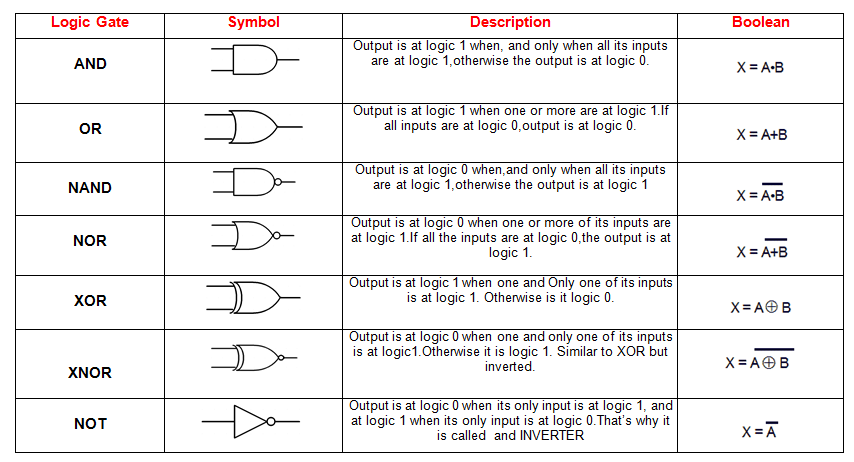

# Logic

## 🤖 Boolean Operations

_Boolean operations are a cornerstone of programming languages - they allow the ability to utilise conditionals and loops based on multiple conditions condensing them into a single boolean._

> In a brief example, imagine you are driving (or cycling). A traffic light is up ahead. The simple conditions for what you do is:
>
> - If the light is green, continue.
> - If the light is red, stop.
>
> However there is a third condition which is more complex
>
> - If the light is orange AND the light would turn red before you cross the line, stop.

This requires 2 (at a minimum) conditions which need to combine not

### And

AND operation combines conditions into `true` if the constiuents are also `true` (so if even one is `false`, the result will be `false`)

```python
areBothTrue = True and False # areBothTrue is False
```

### Or

OR operation combines conditions into `true` if any of the constuents are `true` (so)

```python
areBothTrue = True or False # areBothTrue is True
```

### Not

NOT operation inverts the boolean

```python
isFalse = not False # isFalse is True
```

---

## 💡 Logic Gates
Logic Gates are another way of understanding the logic (or combination)

### Logic Table



### Interactive Example

[Try building your own logic flows here](https://logic.ly/demo/) to understand how these logic and boolean conditions work in a real situation.

---

## 🔢 Comparison Operations

### Equality Comparison
Equality Comparison

Generally speaking, this is done with two (or more) equals symbols (e.g. `==` or `===`)

If the type of the value


### Value (quantity) Comparison

For numbers, letters and strings, 2 values can be compared

- `>=` / `>` - Greater Than (or equal To)

```Python
isTenGreaterThanFive = 10 > 5 # True
isAGreaterThanB = 'a' > 'b' #False as 'a' has lower unicode value
```

- `<=` / `<` - Less Then (or equal to)

```Python
isTenGreaterThanFive = 10 < 5 # False
isAGreaterThanB = 'a' < 'b' #True as 'a' has lower unicode value
```

### Comparing Values of Different Types
While all of this is great for matching types (e.g. numbers), languages will have very different ways of handling it