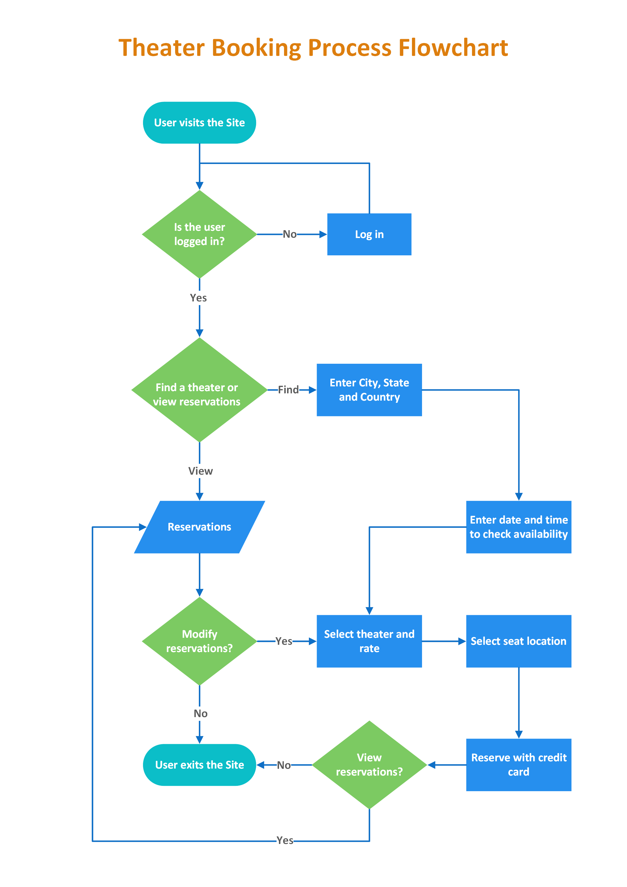

# What Is Software Development?

## ❓Why Are You Here?

When you said to yourself _"I think I will have a go at learning programming / coding / development / software"_, there may have been an idea of something that you found inspiring.

You may:

- ...have seen AI robots on the news and wanted to join the AI revolution to kill all humans.
- ...want the relatively high salary and are mostly in it for the money, prepared to stand the notoriety of Software Engineer personalities to do get that money.
- ...want to follow in the footsteps of someone who is enjoying their life
- ...not know what to do with your life

All of these reasons are, shockingly, valid enough to get into programming (or indeed, anything). There's no right way in, you don't have to have dreamed in code when you were aged eleven.

However, be warned. While I think programming can be learned by anyone, mastery to point where you are satisfied is a different question. Programming at a professional level requires in depth knowledge on a number of sprawling areas, and requires the determination to deliver.

At the heart of this point is: Understand why you are looking to learn programming and understand what your end goal. Anything is possible, but everything can't be achieved, so understanding exactly how long you are along for the ride should determine how much you are willing to learn, and what your drive to learn and direction is.

> Think of it as learning a foreign language. You may simply want to go on holiday and order in the native language. You may want to learn it well to talk to your partner in their native tongue. You may want to master it to become a foreign diplomat. You may want to master it to write poetry in that language. The level, duration and focus of your learning is shaped in all these cases by what you want to achieve and what your motivation is.

## 🤔 What constitutes programming?

Programming is the process of writing a task, or series of tasks, for a computer to carry out.

Much of programming can be conceptualised in a flowchard diagram - a series of decisions that determine an outcome.

In programming however, much of that process is determining that information from data, sensors, other programs and so on - generally abstract things that a computer can transfer into binary data that means something.

It should calm you to know that while this should seem simple enough to grasp, hard to do right now, this basic concept underlies the majority of software that runs our modern world. Websites are code that gives you back data depending on the URL. Games are code that renders a world and makes user interactions logically interact with their world. And so on, and so on.

Programming is simple to conceptualise, sprawling & diverse in application.

## 🛣️ Pathways

- **Web Development**:
- **App Development**:
- **Game Development**:
- **Data Science**:

There are many more bespoke pathways. Every machine needs software to operate, so there are multiple industries and levels that software engineering and programming applies to.

---

## 🎽 Quick Exercises

- Write down what you are aiming to achieve. Be honest with yourself, and reflect on how that is going to affect your study, dedication and limits.
- (optional) Write down a specific job you might like to do (i.e. what company, what position, what specialty?)
